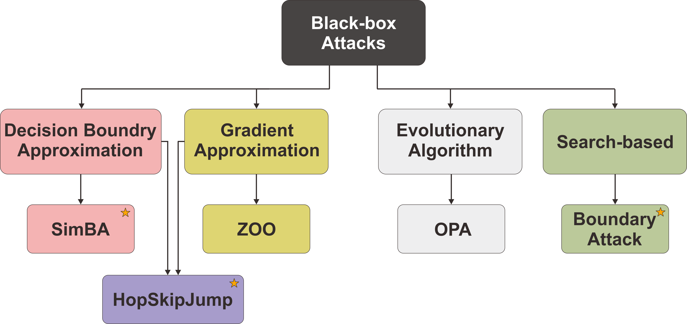
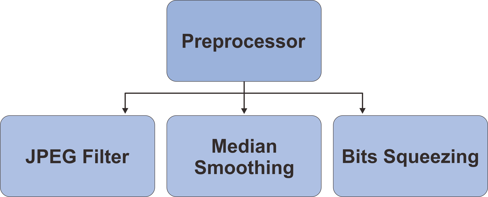

# Black Box Attacks and Defenses 
Purpose: Testing black-box attacks and defenses on diverse models

### Tasks 
* Investigating the impact of noise 
* Investigating behavior of the black-box attacks across different dataset 
* Investigating impact of number of classes on black-box attacks 

### Experiments: 
* Experiment 1: Correlation between model complexity and robustness 
* Experiment 2: Correlation between model diversity and robustness
* Experiment 3: Black-box attacks across different dataset 
* Experiment 4: Defenses against black-box attacks 

  ### Attacks 
  | Attack       | Attack Type | Parameters | 
  | ------------ | ----------- | ---------- | 
  | [SimBA](https://arxiv.org/pdf/1905.07121.pdf) | Decision Boundary Approximation  | epsilon = 0.05, max_iter=5000 | 
  | [HopSkipJump](https://arxiv.org/pdf/1904.02144.pdf) | Gradient Approximation  | max_iter=20 | 
  | [BoundaryAttack](https://arxiv.org/pdf/1712.04248.pdf) | Search-based | epsilon=0.01, max_iter=1000 | 
  
    
  
  ### ImageNet - Models with different complexity  
  | Model        | Top 1% Accuracy | Top 5% Accuracy | Model Size | Total Params | 
  | ------------ | --------------- | --------------- | ---------- | ------------ | 
  | ResNet 18    | 69.758          | 89.078          | 44.7 MB    | 11,689,512   | 
  | ResNet 34    | 71.314          | 91.420          | 83.3 MB    | 21,797,672   | 
  | ResNet 50    | 76.130          | 92.862          | 97.8 MB    | 25,557,032   | 
  | ResNet 101   | 77.374          | 93.546          | 171 MB     | 44,549,160   |
  | ResNet 152   | 78.312          | 94.046          | 230 MB     | 60,192,808   | 
  | VGG 11       | 69.020          | 88.628          | 507 MB     | 132,863,336  |  
  | VGG 13       | 69.928          | 89.246          | 508 MB     | 133,047,848  | 
  | VGG 16       | 71.592          | 90.382          | 528 MB     | 138,357,544  | 
  | VGG 19       | 72.376          | 90.876          | 548 MB     | 143,667,240  | 
  | DenseNet 121 | 74.434          | 91.972          | 30.8 MB    | 7,978,856    |
  | DenseNet 169 | 75.600          | 92.806          | 54.7 MB    | **14,149,480**   |
  | DenseNet 201 | **76.896**      | **93.370**      | **77.4 MB**| **20,013,928**   | 
  
  #### ImageNet - Diverse Models  
  | Model        | Top 1% Accuracy | Top 5% Accuracy | Model Size | Total Params | Source    | 
  | ------------ | --------------- | --------------- | ---------- | ------------ | --------- | 
  | VGG 19       | 72.376          | 90.876          | 548 MB     | 143,667,240  | [PyTorch](https://pytorch.org/vision/stable/models.html) | 
  | ResNet 152   | 78.312          | 94.046          | 230 MB     | 60,192,808   | [PyTorch](https://pytorch.org/vision/stable/models.html) | 
  | DenseNet 161 | 77.138          | 93.560          | 110 MB     | 28,681,000   | [PyTorch](https://pytorch.org/vision/stable/models.html) | 
  | Inception V3 | 77.294          | 93.450          | 104 MB     | 27,161,264   | [PyTorch](https://pytorch.org/vision/stable/models.html) |   
  | Xception     | 78.888          | 94.292          | 87.4 MB    | 22,855,952   | [pretrainedmodels](https://github.com/Cadene/pretrained-models.pytorch) | 
  | GoogLeNet    | 69.778          | 89.530          | 49.7 MB    | 6,624,904    | [PyTorch](https://pytorch.org/vision/stable/models.html) | 
  | MobileNet V2 | 71.878          | 90.286          | 13.6 MB    | 3,504,872    | [PyTorch](https://pytorch.org/vision/stable/models.html) | 

  
  * VGG: [Very Deep Convolutional Networks for Large-Scale Image Recognition](https://arxiv.org/abs/1409.1556v6)
  * ResNet: [Deep Residual Learning for Image Recognition](https://arxiv.org/abs/1512.03385v1) 
  * DenseNet: [Densely Connected Convolutional Networks](https://arxiv.org/abs/1608.06993v5)   
  * Xception: [Xception: Deep Learning with Depthwise Separable Convolutions](https://arxiv.org/abs/1610.02357)
  * Inception: [Rethinking the Inception Architecture for Computer Vision](https://arxiv.org/abs/1512.00567v3)
  * GoogLeNet: [Going Deeper with Convolutions](https://arxiv.org/abs/1409.4842)
  * MobileNetV2: [MobileNetV2: Inverted Residuals and Linear Bottlenecks](https://arxiv.org/abs/1801.04381) 

  #### Defenses   
  | Defense Technique    | Parameter | Source    | 
  | -------------------- | --------- | --------- | 
  | JPEG Filter          | quality=75  | [AdverTorch](https://github.com/BorealisAI/advertorch) |
  | Median Smoothing     | kernel_size=2 (weak) | [AdverTorch](https://github.com/BorealisAI/advertorch) |
  | Bits Squeezing       | bit_depth=4 (weak) | [AdverTorch](https://github.com/BorealisAI/advertorch) | 

   

  #### Device Information 
  | Device           | Device Name                 | 
  | -----------------| ----------------------------|
  | GPU              | GeForce RTX 2080 Ti (12 GB) | 
  
  #### Metrics 
  | Metrics                                    | Description           | 
  | ------------------------------------------ | --------------------- |
  | Attack Success Rate                        | number of successful attacks | 
  | Misclassification confidence               | confidence for misclassified image after attack    | 
  | Structural Similarity (SSIM) - Noise Rate  | noise rate = 1 − SSIM (Structural Similarity)      | 
  | Attack Time                                | average attack time for each image (in secs)       | 
  | L1 distance                                | difference between benign and adversarial examples |

  --- 
  
  ### Results 
  #### Black-Box Attacks on ImageNet - Experiment 1 
  **SimBA (epsilon = 0.05, max_iter=5000)** 
  
  |Target Model |	Average Benign Confidence |	Attack Success Rate	| Attack Failure Rate| 	Average Attack Time (sec) |	Average Noise Rate|	Average L1 Distance| 
  | ----------- | ----------- |  ----------- |  ----------- |  ----------- |  ----------- |  ----------- |  
  |ResNet 18	| 0.941 ± 0.084	| 148/200 (0.185±0.107)|	52/200 (0.450±0.270)	|47.2122 ± 16.0671	|0.00449 ± 0.00407	|0.01672 ± 0.00310|
  |ResNet 34	| 0.970 ± 0.053	|124/200 (0.204±0.115)	|76/200 (0.523±0.246)	|64.3470 ± 22.9962	|0.00468 ± 0.00435	|0.01697 ± 0.00336|
  |ResNet 50	| 0.977 ± 0.043	|91/200 (0.222±0.113)	|109/200 (0.541±0.271)	|77.2420 ± 21.9345	|0.00517 ± 0.00396	|0.01774 ± 0.00292|
  |ResNet 101 | 0.982 ± 0.045	|91/200 (0.245±0.130)	|109/200 (0.670±0.249)	|121.0145 ± 36.6625	|0.00516 ± 0.00426	|0.01752 ± 0.00294|
  |ResNet 152 | 0.984 ± 0.044	|77/200 (0.254±0.127)	|123/200 (0.694±0.273)	|188.2469 ± 44.8877	|0.00549 ± 0.00401	|0.01817 ± 0.00254|
  |VGG 11 |	0.904 ± 0.101	|125/200 (0.191±0.111)	|75/200 (0.498±0.274)	|50.9692 ± 18.1221	|0.00460 ± 0.00387	|0.01694 ± 0.00345|
  |VGG 13 |	0.938 ± 0.078	|126/200 (0.205±0.114)	|74/200 (0.509±0.259)	|60.9870 ± 20.4971	|0.00456 ± 0.00361	|0.01703 ± 0.00315|
  |VGG 16 |	0.953 ± 0.066	|117/200 (0.219±0.121)	|83/200 (0.559±0.276)	|63.0484 ± 19.6964	|0.00480 ± 0.00358	|0.01735 ± 0.00310|
  |VGG 19 |	0.960 ± 0.061	|124/200 (0.235±0.125)	|76/200 (0.581±0.267)	|68.6347 ± 20.5632	|0.00482 ± 0.00354	|0.01733 ± 0.00299|
  |DenseNet 121	| 0.965 ± 0.087	|109/200 (0.206±0.119)	|91/200 (0.527±0.270)	|183.0852 ± 58.8992	|0.00453 ± 0.00383	|0.01673 ± 0.00305|
  |DenseNet 169	| 0.976 ± 0.071	|98/200 (0.227±0.138)	|102/200 (0.533±0.293)	|249.5502 ± 72.9412	|0.00484 ± 0.00374	|0.01718 ± 0.00306|
  |DenseNet 201	| 0.976 ± 0.064	|75/200 (0.199±0.128)	|125/200 (0.478±0.283)	|292.8424 ± 80.4696	|0.00530 ± 0.00423	|0.01774 ± 0.00295|
  
  **HopSkipJump (max_iter=20)**  
  
  | Target Model  | Average Benign Confidence  | Attack Success Rate   | Attack Failure Rate | Average Attack Time (sec) | Average Noise Rate | Average L1 Distance |
  |---------------|----------------------------|-----------------------|---------------------|---------------------------|--------------------|---------------------|
  | ResNet 18     | 0.941 ± 0.084              | 200/200 (0.492±0.141) | 0/200 (nan±nan)     | 51.5236 ± 1.3286          | 0.03851 ± 0.04643  | 0.03624 ± 0.02300   |
  | ResNet 34     | 0.970 ± 0.053              | 200/200 (0.546±0.162) | 0/200 (nan±nan)     | 56.9603 ± 1.3651          | 0.04267 ± 0.05039  | 0.03882 ± 0.02041   |
  | ResNet 50     | 0.977 ± 0.043              | 200/200 (0.593±0.167) | 0/200 (nan±nan)     | 60.5519 ± 1.2607          | 0.05010 ± 0.06149  | 0.04285 ± 0.02732   |
  | ResNet 101    | 0.982 ± 0.045              | 199/200 (0.639±0.171) | 1/200 (0.997±nan)   | 65.0762 ± 5.2179          | 0.05781 ± 0.06173  | 0.04665 ± 0.02850   |
  | ResNet 152    | 0.984 ± 0.044              | 200/200 (0.656±0.174) | 0/200 (nan±nan)     | 71.1572 ± 1.8936          | 0.06175 ± 0.05460  | 0.04963 ± 0.02709   |
  | VGG 11        | 0.904 ± 0.101              | 200/200 (0.406±0.132) | 0/200 (nan±nan)     | 56.2350 ± 1.0725          | 0.03314 ± 0.04014  | 0.03236 ± 0.02012   |
  | VGG 13        | 0.938 ± 0.078              | 200/200 (0.470±0.146) | 0/200 (nan±nan)     | 60.1101 ± 1.2033          | 0.02670 ± 0.03366  | 0.02940 ± 0.01941   |
  | VGG 16        | 0.953 ± 0.066              | 200/200 (0.510±0.163) | 0/200 (nan±nan)     | 61.9172 ± 2.7018          | 0.02679 ± 0.02987  | 0.03036 ± 0.01816   |
  | VGG 19        | 0.960 ± 0.061              | 200/200 (0.504±0.160) | 0/200 (nan±nan)     | 63.7490 ± 2.2588          | 0.02627 ± 0.03030  | 0.02960 ± 0.01833   |
  | DenseNet 121  | 0.965 ± 0.087              | 200/200 (0.594±0.163) | 0/200 (nan±nan)     | 64.1950 ± 1.8271          | 0.06147 ± 0.05420  | 0.04984 ± 0.02706   |
  | DenseNet 169  | 0.976 ± 0.071              | 200/200 (0.677±0.164) | 0/200 (nan±nan)     | 68.4440 ± 1.7098          | 0.07687 ± 0.07058  | 0.05630 ± 0.02899   |
  | DenseNet 201  | 0.976 ± 0.064              | 200/200 (0.673±0.162) | 0/200 (nan±nan)     | 73.1319 ± 2.7482          | 0.08604 ± 0.07269  | 0.06040 ± 0.03191   |

  **Boundary Attack (epsilon=0.01, max_iter=1000)**  
  
  | Target Model  | Average Benign Confidence  | Attack Success Rate   | Attack Failure Rate | Average Attack Time (sec) | Average Noise Rate | Average L1 Distance |
  |---------------|----------------------------|-----------------------|---------------------|---------------------------|--------------------|---------------------|
  | ResNet 18     | 0.941 ± 0.084              | 199/200 (0.371±0.092) | 1/200 (0.415±nan)   | 176.3488 ± 5.9796         | 0.04393 ± 0.05331  | 0.03889 ± 0.02432   |
  | ResNet 34     | 0.970 ± 0.053              | 198/200 (0.394±0.092) | 2/200 (0.301±0.081) | 194.1793 ± 11.7778        | 0.04762 ± 0.05899  | 0.04142 ± 0.02289   |
  | ResNet 50     | 0.977 ± 0.043              | 200/200 (0.394±0.104) | 0/200 (nan±nan)     | 211.1478 ± 7.9529         | 0.05576 ± 0.06520  | 0.04580 ± 0.02912   |
  | ResNet 101    | 0.982 ± 0.045              | 198/200 (0.424±0.083) | 2/200 (0.635±0.511) | 229.2638 ± 20.736         | 0.05879 ± 0.06369  | 0.04729 ± 0.03014   |
  | ResNet 152    | 0.984 ± 0.044              | 200/200 (0.420±0.085) | 0/200 (nan±nan)     | 263.1114 ± 5.2847         | 0.07223 ± 0.07247  | 0.05406 ± 0.03247   |
  | VGG 11        | 0.904 ± 0.101              | 198/200 (0.332±0.098) | 2/200 (0.156±0.001) | 208.7357 ± 9.0831         | 0.04200 ± 0.05132  | 0.03693 ± 0.02318   |
  | VGG 13        | 0.938 ± 0.078              | 195/200 (0.361±0.097) | 5/200 (0.353±0.118) | 221.9798 ± 19.8167        | 0.03039 ± 0.03769  | 0.03152 ± 0.01975   |
  | VGG 16        | 0.953 ± 0.066              | 197/200 (0.375±0.102) | 3/200 (0.445±0.076) | 234.2048 ± 15.9714        | 0.03143 ± 0.03415  | 0.03292 ± 0.01996   |
  | VGG 19        | 0.960 ± 0.061              | 198/200 (0.374±0.103) | 2/200 (0.427±0.093) | 241.3403 ± 15.0322        | 0.03084 ± 0.03483  | 0.03234 ± 0.02033   |
  | DenseNet 121  | 0.965 ± 0.087              | 198/200 (0.398±0.092) | 2/200 (0.381±0.020) | 221.7569 ± 14.1639        | 0.07122 ± 0.06726  | 0.05350 ± 0.03091   |
  | DenseNet 169  | 0.976 ± 0.071              | 199/200 (0.423±0.077) | 1/200 (0.410±nan)   | 244.5649 ± 53.0680        | 0.08420 ± 0.07323  | 0.06047 ± 0.03337   |
  | DenseNet 201  | 0.976 ± 0.064              | 197/200 (0.428±0.074) | 3/200 (0.492±0.007) | 256.6286 ± 13.9625        | 0.09277 ± 0.07964  | 0.06353 ± 0.03447   |
  
  --- 
  
  #### Black-Box Attacks on diverse models (ImageNet) - Experiment 2  
  **SimBA (epsilon = 0.05, max_iter=5000)** 
  
  | Target Model         | Average Benign Confidence  | Attack Success Rate   | Attack Failure Rate   | Average Attack Time (sec) | Average Noise Rate | Average L1 Distance |
  |----------------------|----------------------------|-----------------------|-----------------------|---------------------------|--------------------|---------------------|
  | VGG 19               | 0.925 ± 0.090              | 146/200 (0.222±0.105) | 54/200 (0.559±0.281)  | 60.6442 ± 22.7765         | 0.00402 ± 0.00290  | 0.01618 ± 0.00334   |
  | ResNet 152           | 0.975 ± 0.048              | 105/200 (0.251±0.122) | 95/200 (0.607±0.273)  | 163.982 ± 51.7468         | 0.00484 ± 0.00346  | 0.01724 ± 0.00310   |
  | DenseNet 161         | 0.982 ± 0.045              | 104/200 (0.212±0.126) | 96/200 (0.564±0.303)  | 210.441 ± 77.4600         | 0.00462 ± 0.00304  | 0.01712 ± 0.00281   |
  | Inception V3         | 0.986 ± 0.045              | 130/200 (0.380±0.132) | 70/200 (0.883±0.177)  | 135.3497 ± 64.8054        | 0.00353 ± 0.00258  | 0.01523 ± 0.00409   |
  | Xception             | 0.991 ± 0.040              | 80/200 (0.380±0.111)  | 120/200 (0.786±0.244) | 73.7648 ± 24.1778         | 0.00432 ± 0.00274  | 0.01647 ± 0.00326   |
  | GoogLeNet            | 0.923 ± 0.078              | 81/200 (0.153±0.107)  | 119/200 (0.292±0.232) | 95.7722 ± 22.7892         | 0.00503 ± 0.00294  | 0.01802 ± 0.00230   |
  | MobileNet V2         | 0.920 ± 0.094              | 158/200 (0.225±0.114) | 42/200 (0.461±0.276)  | 59.6188 ± 25.5618         | 0.00372 ± 0.00323  | 0.01543 ± 0.00348   |
  
  **HopSkipJump (max_iter=20)**
  
  | Target Model         | Average Benign Confidence  | Attack Success Rate   | Attack Failure Rate | Average Attack Time (sec) | Average Noise Rate | Average L1 Distance |
  |----------------------|----------------------------|-----------------------|---------------------|---------------------------|--------------------|---------------------|
  | VGG 19               | 0.925 ± 0.090              | 200/200 (0.465±0.157) | 0/200 (nan±nan)     | 59.4952 ± 1.0242          | 0.01785 ± 0.02984  | 0.02256 ± 0.01702   |
  | ResNet 152           | 0.975 ± 0.048              | 200/200 (0.604±0.180) | 0/200 (nan±nan)     | 65.5719 ± 1.1067          | 0.04589 ± 0.05814  | 0.04044 ± 0.02866   |
  | DenseNet 161         | 0.982 ± 0.045              | 200/200 (0.703±0.165) | 0/200 (nan±nan)     | 67.4440 ± 0.7149          | 0.06851 ± 0.07366  | 0.05342 ± 0.03430   |
  | Inception V3         | 0.986 ± 0.045              | 200/200 (0.750±0.193) | 0/200 (nan±nan)     | 56.4146 ± 0.9733          | 0.04382 ± 0.04940  | 0.03957 ± 0.02758   |
  | Xception             | 0.991 ± 0.040              | 200/200 (0.816±0.164) | 0/200 (nan±nan)     | 55.4973 ± 0.7314          | 0.06909 ± 0.06468  | 0.05390 ± 0.03144   |
  | GoogLeNet            | 0.923 ± 0.078              | 200/200 (0.414±0.152) | 0/200 (nan±nan)     | 49.0577 ± 0.5332          | 0.06645 ± 0.07468  | 0.05209 ± 0.03496   |
  | MobileNet V2         | 0.920 ± 0.094              | 200/200 (0.490±0.151) | 0/200 (nan±nan)     | 47.9458 ± 0.2375          | 0.02101 ± 0.02954  | 0.02507 ± 0.01829   |
  
  **Boundary Attack (epsilon=0.01, max_iter=1000)**  
  
  | Target Model         | Average Benign Confidence  | Attack Success Rate   | Attack Failure Rate  | Average Attack Time (sec) | Average Noise Rate | Average L1 Distance |
  |----------------------|----------------------------|-----------------------|----------------------|---------------------------|--------------------|---------------------|
  | VGG 19               | 0.925 ± 0.090              | 199/200 (0.365±0.100) | 1/200 (0.351±nan)    | 246.1453 ± 8.6665         | 0.02029 ± 0.03297  | 0.02443 ± 0.01849   |
  | ResNet 152           | 0.975 ± 0.048              | 200/200 (0.407±0.088) | 0/200 (nan±nan)      | 259.8923 ± 7.1716         | 0.04745 ± 0.05514  | 0.04197 ± 0.02865   |
  | DenseNet 161         | 0.982 ± 0.045              | 200/200 (0.436±0.069) | 0/200 (nan±nan)      | 270.1788 ± 2.7418         | 0.07558 ± 0.08025  | 0.05757 ± 0.03863   |
  | Inception V3         | 0.986 ± 0.045              | 138/200 (0.468±0.060) | 62/200 (0.462±0.065) | 204.2199 ± 45.6419        | 0.05664 ± 0.06830  | 0.04603 ± 0.03454   |
  | Xception             | 0.991 ± 0.040              | 200/200 (0.460±0.061) | 0/200 (nan±nan)      | 217.6007 ± 9.2666         | 0.07092 ± 0.07094  | 0.05550 ± 0.03693   |
  | GoogLeNet            | 0.923 ± 0.078              | 200/200 (0.313±0.118) | 0/200 (nan±nan)      | 179.9433 ± 10.8016        | 0.07183 ± 0.07838  | 0.05467 ± 0.03725   |
  | MobileNet V2         | 0.920 ± 0.094              | 200/200 (0.375±0.094) | 0/200 (nan±nan)      | 175.8230 ± 9.8891         | 0.02276 ± 0.03125  | 0.02645 ± 0.01905   |
  
  ---- 
  
  #### Black-Box Attacks across dataset - Experiment 3 
  
  #### CIFAR 100 
  **SimBA (epsilon = 0.05, max_iter=5000)**  
  
  | Target Model  | Average Benign Confidence  | Attack Success Rate   | Attack Failure Rate  | Average Attack Time (sec) | Average Noise Rate | Average L1 Distance |
  |---------------|----------------------------|-----------------------|----------------------|---------------------------|--------------------|---------------------|
  | ResNet 18     | 0.984 ± 0.043              | 199/200 (0.233±0.127) | 1/200 (0.607±nan)    | 9.3450 ± 6.0427           | 0.01243 ± 0.01629  | 0.07173 ± 0.02273   |
  | ResNet 34     | 0.986 ± 0.034              | 197/200 (0.298±0.122) | 3/200 (0.435±0.209)  | 14.7183 ± 10.3822         | 0.01223 ± 0.01450  | 0.07147 ± 0.02536   |
  | ResNet 50     | 0.990 ± 0.039              | 198/200 (0.323±0.115) | 2/200 (0.934±0.028)  | 21.0251 ± 12.5578         | 0.01353 ± 0.01560  | 0.07637 ± 0.02410   |
  | ResNet 101    | 0.990 ± 0.030              | 191/200 (0.341±0.113) | 9/200 (0.747±0.236)  | 48.7537 ± 32.2957         | 0.01668 ± 0.02104  | 0.08640 ± 0.03248   |
  | ResNet 152    | 0.988 ± 0.040              | 193/200 (0.314±0.119) | 7/200 (0.766±0.322)  | 69.1301 ± 41.3731         | 0.01537 ± 0.01710  | 0.08387 ± 0.02819   |
  | VGG 11        | 0.973 ± 0.056              | 178/200 (0.253±0.126) | 22/200 (0.456±0.297) | 8.8370 ± 5.3811           | 0.02062 ± 0.02502  | 0.09728 ± 0.03700   |
  | VGG 13        | 0.979 ± 0.049              | 197/200 (0.241±0.124) | 3/200 (0.728±0.232)  | 7.6029 ± 4.6894           | 0.01508 ± 0.01903  | 0.08221 ± 0.02691   |
  | VGG 16        | 0.989 ± 0.030              | 188/200 (0.316±0.117) | 12/200 (0.591±0.240) | 9.1624 ± 6.2937           | 0.01536 ± 0.02173  | 0.08155 ± 0.02926   |
  | VGG 19        | 0.994 ± 0.022              | 181/200 (0.425±0.077) | 19/200 (0.901±0.157) | 11.8459 ± 9.1197          | 0.01544 ± 0.01864  | 0.08261 ± 0.03427   |
  | DenseNet 121  | 0.994 ± 0.018              | 197/200 (0.393±0.092) | 3/200 (0.946±0.036)  | 47.1041 ± 33.9134         | 0.01305 ± 0.02003  | 0.07244 ± 0.02527   |
  | DenseNet 169  | 0.994 ± 0.023              | 184/200 (0.406±0.087) | 16/200 (0.900±0.128) | 77.7352 ± 61.9696         | 0.01472 ± 0.01891  | 0.07839 ± 0.03130   |
  | DenseNet 201  | 0.993 ± 0.023              | 192/200 (0.419±0.075) | 8/200 (0.839±0.240)  | 86.7301 ± 60.4999         | 0.01479 ± 0.01824  | 0.07911 ± 0.02811   |
  
  
  
  ### Examples 
   
  

  ### Defenses  
  
  ### Example 
    
  
