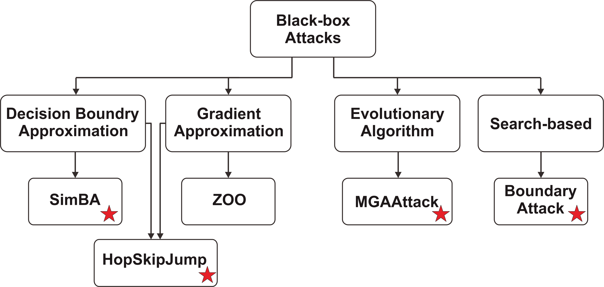

# Black Box Attacks and Defenses 
Purpose: Testing black-box attacks and defenses on diverse models

### Tasks 
* Investigating the impact of noise 
* Investigating behavior of the black-box attacks across different dataset 
* Investigating impact of number of classes on black-box attacks 

### Experiments: 
* Experiment 1: Correlation between model complexity and robustness 
* Experiment 2: Correlation between model diversity and robustness
* Experiment 3: Black-box attacks across different dataset 
* Experiment 4: Defenses against black-box attacks 

  ### Attacks 
  | Attack       | Attack Type | Parameters | 
  | ------------ | ----------- | ---------- | 
  | [SimBA](https://arxiv.org/pdf/1905.07121.pdf) | Decision Boundary Approximation  | epsilon = 0.05, max_iter=5000 | 
  | [HopSkipJump](https://arxiv.org/pdf/1904.02144.pdf) | Gradient Approximation  | max_iter=20 | 
  | [BoundaryAttack](https://arxiv.org/pdf/1712.04248.pdf) | Search-based | epsilon=0.01, max_iter=1000 | 
  
    
  
  ### ImageNet - Models with different complexity  
  | Model        | Top 1% Accuracy | Top 5% Accuracy | Model Size | Total Params | 
  | ------------ | --------------- | --------------- | ---------- | ------------ | 
  | ResNet 18    | 69.758          | 89.078          | 44.7 MB    | 11,689,512   | 
  | ResNet 34    | 71.314          | 91.420          | 83.3 MB    | 21,797,672   | 
  | ResNet 50    | 76.130          | 92.862          | 97.8 MB    | 25,557,032   | 
  | ResNet 101   | 77.374          | 93.546          | 171 MB     | 44,549,160   |
  | ResNet 152   | 78.312          | 94.046          | 230 MB     | 60,192,808   | 
  | VGG 11       | 69.020          | 88.628          | 507 MB     | 132,863,336  |  
  | VGG 13       | 69.928          | 89.246          | 508 MB     | 133,047,848  | 
  | VGG 16       | 71.592          | 90.382          | 528 MB     | 138,357,544  | 
  | VGG 19       | 72.376          | 90.876          | 548 MB     | 143,667,240  | 
  | DenseNet 121 | 74.434          | 91.972          | 30.8 MB    | 7,978,856    |
  | DenseNet 169 | 75.600          | 92.806          | 54.7 MB    | **14,149,480**   |
  | DenseNet 201 | **76.896**      | **93.370**      | **77.4 MB**| **20,013,928**   | 
  
  #### ImageNet - Diverse Models  
  | Model        | Top 1% Accuracy | Top 5% Accuracy | Model Size | Total Params | Source    | 
  | ------------ | --------------- | --------------- | ---------- | ------------ | --------- | 
  | VGG 19       | 72.376          | 90.876          | 548 MB     | 143,667,240  | [PyTorch](https://pytorch.org/vision/stable/models.html) | 
  | ResNet 152   | 78.312          | 94.046          | 230 MB     | 60,192,808   | [PyTorch](https://pytorch.org/vision/stable/models.html) | 
  | DenseNet 161 | 77.138          | 93.560          | 110 MB     | 28,681,000   | [PyTorch](https://pytorch.org/vision/stable/models.html) | 
  | Inception V3 | 77.294          | 93.450          | 104 MB     | 27,161,264   | [PyTorch](https://pytorch.org/vision/stable/models.html) |   
  | Xception     | 78.888          | 94.292          | 87.4 MB    | 22,855,952   | [pretrainedmodels](https://github.com/Cadene/pretrained-models.pytorch) | 
  | GoogLeNet    | 69.778          | 89.530          | 49.7 MB    | 6,624,904    | [PyTorch](https://pytorch.org/vision/stable/models.html) | 
  | MobileNet V2 | 71.878          | 90.286          | 13.6 MB    | 3,504,872    | [PyTorch](https://pytorch.org/vision/stable/models.html) | 

  
  * VGG: [Very Deep Convolutional Networks for Large-Scale Image Recognition](https://arxiv.org/abs/1409.1556v6)
  * ResNet: [Deep Residual Learning for Image Recognition](https://arxiv.org/abs/1512.03385v1) 
  * DenseNet: [Densely Connected Convolutional Networks](https://arxiv.org/abs/1608.06993v5)   
  * Xception: [Xception: Deep Learning with Depthwise Separable Convolutions](https://arxiv.org/abs/1610.02357)
  * Inception: [Rethinking the Inception Architecture for Computer Vision](https://arxiv.org/abs/1512.00567v3)
  * GoogLeNet: [Going Deeper with Convolutions](https://arxiv.org/abs/1409.4842)
  * MobileNetV2: [MobileNetV2: Inverted Residuals and Linear Bottlenecks](https://arxiv.org/abs/1801.04381) 

  #### Defenses   
  | Defense Technique    | Parameter | Source    | 
  | -------------------- | --------- | --------- | 
  | JPEG Filter          | quality=75  | [AdverTorch](https://github.com/BorealisAI/advertorch) |
  | Median Smoothing     | kernel_size=2 (weak) | [AdverTorch](https://github.com/BorealisAI/advertorch) |
  | Bits Squeezing       | bit_depth=4 (weak) | [AdverTorch](https://github.com/BorealisAI/advertorch) | 

   

  #### Device Information 
  | Device           | Device Name                 | 
  | -----------------| ----------------------------|
  | GPU              | GeForce RTX 2080 Ti (12 GB) | 
  
  #### Metrics 
  | Metrics                                    | Description           | 
  | ------------------------------------------ | --------------------- |
  | Attack Success Rate                        | number of successful attacks | 
  | Misclassification confidence               | confidence for misclassified image after attack    | 
  | Structural Similarity (SSIM) - Noise Rate  | noise rate = 1 − SSIM (Structural Similarity)      | 
  | Attack Time                                | average attack time for each image (in secs)       | 
  | L1 distance                                | difference between benign and adversarial examples |

  --- 
  
  ### Results 
  #### Black-Box Attacks on ImageNet - Experiment 1 
  **SimBA (epsilon = 0.5, max_iter=6000)** 
  
  |Target Model |	Average Benign Confidence |	Attack Success Rate	| Attack Failure Rate| 	Average Attack Time (sec) |	Average Noise Rate|	Average L1 Distance| 
  | ----------- | ----------- |  ----------- |  ----------- |  ----------- |  ----------- |  ----------- |  
  | ResNet 18	  | 0.945±0.076	| 1000/1K (0.173±0.103)	| 0 (nan±nan)	| 7.4463±4.277  |	0.02908±0.03653	| 0.06309±0.01313 | 
  | ResNet 34	  | 0.970±0.055	| 1000/1K (0.203±0.115)	| 0 (nan±nan)	| 9.9681±5.8249 | 0.02970±0.03583	| 0.06279±0.01393 | 
  | ResNet 50	  | 0.973±0.053	| 997/1K (0.189±0.121)	| 3 (0.482±0.298) | 14.8773±11.8107	| 0.03384±0.04185	| 0.06419±0.01669 | 
  | Resnet 101	| 0.981±0.045	| 991/1K (0.211±0.121)	    | 9 (0.35±0.206)	| 27.2017±24.2607	| 0.03799±0.04348	| 0.06657±0.01807 | 
  | Resnet152	  | 0.984±0.040	| 984/1K (0.215±0.123)	    | 16 (0.384±0.23) |	41.3683±36.6773	| 0.04266±0.04426	| 0.07056±0.01776 | 
  | VGG 11	    | 0.905±0.095	| 1000/1K (0.183±0.105)	  | 0 (nan±nan)	    | 8.8261±6.0393	  | 0.03447±0.04216	| 0.06785±0.01743 | 
  | VGG 13	    | 0.933±0.084	| 999/1K (0.193±0.110)	    | 1 (0.242±nan)	  | 10.5033±7.231	  | 0.03714±0.04238	| 0.07085±0.01735 | 
  | VVGG 16	    | 0.959±0.061	| 1000/1K (0.196±0.113)	  | 0 (nan±nan)     |	12.5412±7.9894 | 0.03979±0.04438	| 0.07259±0.01755 | 
  | VGG 19	    | 0.960±0.066	| 999/1K (0.204±0.115)	    | 1 (0.007±nan)	  | 13.9751±9.3382	| 0.04061±0.04445	| 0.07375±0.01811 | 
  | DenseNet 121| 0.971±0.065	| 988/1K (0.176±0.116)	    | 1 (0.007±nan)	  | 29.0344±27.2336	| 0.03346±0.04096	| 0.06431±0.01606 | 
  | DenseNet 169	| 0.983±0.051	| 980/1K (0.179±0.127)	| 20 (0.187±0.192)	| 46.9928±43.5858	| 0.03627±0.03936	| 0.06643±0.01580 | 
  | DenseNet 201	| 0.978±0.055	| 977/1K (0.151±0.123)	| 23 (0.174±0.248)	| 59.1824±53.5051	| 0.03929±0.04336	| 0.06700±0.01693 | 
  
  **HopSkipJump (max_iter=20)**  
  
  | Target Model  | Average Benign Confidence  | Attack Success Rate   | Attack Failure Rate | Average Attack Time (sec) | Average Noise Rate | Average L1 Distance |
  |---------------|----------------------------|-----------------------|---------------------|---------------------------|--------------------|---------------------|
  | ResNet 18     | 0.945±0.076	               | 1000/1K (0.488±0.144) | 0/1K (nan±nan)      | 67.219±1.0061	           | 0.03992±0.05445	  | 0.03623±0.02574     |
  | ResNet 34     | 0.970±0.055                | 1000/1K (0.558±0.159) | 0/1K (nan±nan)      | 68.4182±0.5081	           | 0.04683±0.05683	  | 0.04051±0.02712     |
  | ResNet 50     | 0.973±0.053	               | 1000/1K (0.582±0.172) | 0/1K (nan±nan)	     | 71.646±0.4572	           | 0.04863±0.06063	  | 0.04139±0.02887     |
  | ResNet 101    | 0.981±0.045	               | 1000/1K (0.632±0.169) | 0/1K (nan±nan)	     | 78.063±0.9825             | 0.05646±0.0636	    | 0.04578±0.03125     |
  | ResNet 152    | 0.984±0.040	               | 1000/1K (0.649±0.181) | 0/1K (nan±nan)	     | 84.7012±2.4505	           | 0.06275±0.06793	  | 0.04936±0.03197     |
  | VGG 11        | 0.905±0.095	               | 1000/1K (0.412±0.135) | 0/1K (nan±nan)	     | 70.2322±1.0834	           | 0.03547±0.04941	  | 0.03317±0.02583     |
  | VGG 13        | 0.933±0.084	               | 1000/1K (0.473±0.150) | 0/1K (nan±nan)	     | 74.1969±2.4507	           | 0.0296±0.04279	    | 0.0302±0.02243      |
  | VGG 16        | 0.959±0.061	               | 999/1K (0.513±0.159)	 | 1/1K (0.999±nan)	   | 73.8973±2.4598	           | 0.03262±0.04209	  | 0.03245±0.02152     |
  | VGG 19        | 0.960±0.066	               | 1000/1K (0.519±0.163) | 0/1K (nan±nan)	     | 75.3607±0.9003	           | 0.02952±0.03959	  | 0.03072±0.02138     |
  | DenseNet 121  | 0.971±0.065	               | 1000/1K (0.600±0.162) | 0/1K (nan±nan)	     | 76.5078±1.0693            | 0.06649±0.06909	  | 0.05087±0.03198     |
  | DenseNet 169  | 0.983±0.051	               | 999/1K (0.690±0.165)	 | 1/1K (1.0±nan)	     | 80.0824±2.6574	           | 0.07863±0.07859	  | 0.0568±0.0366       |
  | DenseNet 201  | 0.978±0.055                | 1000/1K (0.66±0.171)  | 0/1K (nan±nan)	     | 83.9503±0.9206	           | 0.08962±0.07766	  | 0.06195±0.03556     |

  **Boundary Attack (epsilon=0.01, max_iter=1000)**  
  
  | Target Model  | Average Benign Confidence  | Attack Success Rate   | Attack Failure Rate | Average Attack Time (sec) | Average Noise Rate | Average L1 Distance |
  |---------------|----------------------------|-----------------------|---------------------|---------------------------|--------------------|---------------------|
  | ResNet 18    | 0.945±0.076 | 990/1K (0.368±0.097) | 10/1K (0.381±0.095) | 206.9153±9.7953  | 0.04746±0.06198 | 0.04023±0.02969 |
  | ResNet 34    | 0.970±0.055 | 995/1K (0.391±0.093) | 5/1K (0.451±0.030)  | 220.099±8.2429   | 0.05341±0.06504 | 0.04393±0.03105 |
  | ResNet 50    | 0.973±0.053 | 994/1K (0.395±0.095) | 6/1K (0.392±0.084)  | 237.3221±17.7772 | 0.05523±0.06888 | 0.0448±0.0332   |
  | ResNet 101   | 0.981±0.045 | 995/1K (0.413±0.086) | 5/1K (0.551±0.253)  | 516.668±81.4534  | 0.06246±0.07092 | 0.04895±0.03613 |
  | ResNet 152   | 0.984±0.040 | 997/1K (0.414±0.088) | 3/1K (0.380±0.114)  | 226.0049±4.9092  | 0.06206±0.06942 | 0.04881±0.03244 |
  | VGG 11       | 0.905±0.095 | 990/1K (0.333±0.100) | 10/1K (0.379±0.084) | 372.9004±35.562  | 0.04312±0.05933 | 0.03724±0.02981 |
  | VGG 13       | 0.933±0.084 | 990/1K (0.360±0.101) | 10/1K (0.350±0.090) | 385.4018±55.4381 | 0.03438±0.04834 | 0.03291±0.02514 |
  | VGG 16       | 0.959±0.061 | 994/1K (0.375±0.095) | 6/1K (0.490±0.270)  | 371.4482±37.5422 | 0.03745±0.04813 | 0.03513±0.0239  |
  | VGG 19       | 0.960±0.066 | 998/1K (0.369±0.100) | 2/1K (0.339±0.19)   | 214.6231±3.8418  | 0.0279±0.03926  | 0.02917±0.02195 |
  | DenseNet 121 | 0.971±0.065 | 998/1K (0.403±0.090) | 2/1K (0.436±0.084)  | 516.8302±81.7951 | 0.0732±0.07499  | 0.05424±0.03544 |
  | DenseNet 169 | 0.983±0.051 | 993/1K (0.428±0.077) | 7/1K (0.557±0.304)  | 327.0907±86.2431 | 0.0856±0.08502  | 0.06055±0.04168 |
  | DenseNet 201 | 0.978±0.055 | 995/1K (0.417±0.087) | 5/1K (0.471±0.022)  | 314.3596±38.5839 | 0.1000±0.08808  | 0.06662±0.04022 |
  
  **MGAAttack**   
  
  | Target Model  | Attack Success Rate | Average Attack Time (sec) | Average Noise Rate | Average Queries  |
  |---------------|---------------------|---------------------------|--------------------|------------------|
  | ResNet 18     | 967                 | 16                        | 0.224              | 534              |
  | ResNet 34     | 956                 | 20                        | 0.225              | 780              |
  | ResNet 50     | 928                 | 23.5                      | 0.225              | 802              |
  | ResNet 101    | 896                 | 32.1                      | 0.225              | 973              |
  | ResNet 152    | 880                 | 44.8                      | 0.226              | 1086             |
  | VGG 11        | 931                 | 37.9                      | 0.129              | 919              |
  | VGG 13        | 963                 | 27.1                      | 0.131              | 634              |
  | VGG 16        | 959                 | 30.8                      | 0.131              | 635              |
  | VGG 19        | 958                 | 32.4                      | 0.131              | 703              |
  | DenseNet 121  | 931                 | 65.9                      | 0.128              | 1064             |
  | DenseNet 169  | 917                 | 76.7                      | 0.127              | 1121             |
  | DenseNet 201  | 877                 | 85.4                      | 0.127              | 1268             |
  
  --- 
  
  #### Black-Box Attacks on diverse models (ImageNet) - Experiment 2  
  **SimBA (epsilon = 0.05, max_iter=5000)** 
  
  | Target Model  | Average Benign Confidence  | Attack Success Rate   | Attack Failure Rate | Average Attack Time (sec) | Average Noise Rate | Average L1 Distance |
  |---------------|----------------------------|-----------------------|---------------------|---------------------------|--------------------|---------------------|
  | VGG 19        | 0.939±0.085 | 999/1K (0.210±0.115)  | 1/1K (0.008±nan)    | 13.3129±8.7667  | 0.03584±0.04174 | 0.06983±0.01745 |
  | ResNet 152    | 0.978±0.05  | 988/1K (0.228±0.128)  | 12/1K (0.375±0.223) | 41.4375±38.3237 | 0.03948±0.04369 | 0.06826±0.01804 |
  | DenseNet 161  | 0.987±0.039 | 991/1K (0.18±0.128)   | 9/1K (0.249±0.302)  | 48.4683±39.2714 | 0.03634±0.04075 | 0.06554±0.01607 |
  | Inception V3  | 0.991±0.039 | 974/1K (0.366±0.14)   | 26/1K (0.743±0.31)  | 42.6511±47.6949 | 0.03818±0.04617 | 0.06742±0.02228 |
  | Xception      | 0.995±0.024 | 913/1K (0.317±0.147)  | 87/1K (0.444±0.353) | 33.0329±29.3309 | 0.05096±0.04836 | 0.07452±0.02128 |
  | GoogLeNet     | 0.932±0.077 | 996/1K (0.101±0.089)  | 4/1K (0.03±0.021)   | 21.738±14.0582  | 0.04563±0.04376 | 0.07746±0.01645 |
  | MobileNet V2  | 0.943±0.08  | 1000/1K (0.217±0.111) | 0/1K (nan±nan)      | 10.4138±6.0203  | 0.02936±0.0369  | 0.06292±0.01443 |
  | ShuffleNet V2 | 0.929±0.089 | 1000/1K (0.224±0.117) | 0/1K (nan±nan)      | 8.2383±5.7636   | 0.02068±0.0314  | 0.05214±0.01369 |
  
  **HopSkipJump (max_iter=20)**
  
  | Target Model  | Average Benign Confidence  | Attack Success Rate   | Attack Failure Rate | Average Attack Time (sec) | Average Noise Rate | Average L1 Distance |
  |---------------|----------------------------|-----------------------|---------------------|---------------------------|--------------------|---------------------|
  | VGG 19        | 0.939±0.085 | 1000/1K (0.487±0.161) | 0/1K (nan±nan) | 59.3101±0.2584 | 0.02460±0.03681 | 0.02697±0.02037 |
  | ResNet 152    | 0.978±0.050 | 1000/1K (0.640±0.174) | 0/1K (nan±nan) | 66.3849±0.3318 | 0.05544±0.06100 | 0.04566±0.02893 |
  | DenseNet 161  | 0.987±0.039 | 1000/1K (0.714±0.164) | 0/1K (nan±nan) | 67.1443±0.3923 | 0.08166±0.07763 | 0.05874±0.03514 |
  | Inception V3  | 0.991±0.039 | 1000/1K (0.788±0.176) | 0/1K (nan±nan) | 55.0527±0.4716 | 0.05809±0.07182 | 0.04603±0.03456 |
  | Xception      | 0.995±0.024 | 1000/1K (0.838±0.149) | 0/1K (nan±nan) | 55.0268±0.3007 | 0.08309±0.08095 | 0.05931±0.03688 |
  | GoogLeNet     | 0.932±0.077 | 1000/1K (0.426±0.159) | 0/1K (nan±nan) | 49.1794±0.3276 | 0.08164±0.08803 | 0.05774±0.03797 |
  | MobileNet V2  | 0.943±0.080 | 1000/1K (0.527±0.151) | 0/1K (nan±nan) | 48.3629±0.2729 | 0.02807±0.03845 | 0.02956±0.02067 |
  | ShuffleNet V2 | 0.929±0.089 | 1000/1K (0.485±0.154) | 0/1K (nan±nan) | 47.3276±0.2999 | 0.01527±0.02960 | 0.01970±0.01856 |
  
  **Boundary Attack (epsilon=0.01, max_iter=1000)**  
  
  | Target Model  | Average Benign Confidence  | Attack Success Rate   | Attack Failure Rate | Average Attack Time (sec) | Average Noise Rate | Average L1 Distance |
  |---------------|----------------------------|-----------------------|---------------------|---------------------------|--------------------|---------------------|
  | VGG 19        | 0.939±0.085 | 998/1K (0.369±0.100)  | 2/1K (0.339±0.19)   | 214.6231±3.8418  | 0.0279±0.03926  | 0.02917±0.02195 |
  | ResNet 152    | 0.978±0.05  | 997/1K (0.414±0.088)  | 3/1K (0.38±0.114)   | 226.0049±4.9092  | 0.06206±0.06942 | 0.04881±0.03244 |
  | DenseNet 161  | 0.987±0.039 | 995/1K (0.439±0.070)  | 5/1K (0.388±0.078)  | 228.8426±4.9522  | 0.09118±0.08658 | 0.06353±0.03982 |
  | Inception V3  | 0.991±0.039 | 718/1K (0.468±0.058)  | 282/1K (0.457±0.07) | 180.8544±42.8384 | 0.0714±0.09164  | 0.05265±0.04447 |
  | Xception      | 0.995±0.024 | 1000/1K (0.469±0.054) | 0/1K (nan±nan)      | 184.9552±2.2703  | 0.08864±0.09156 | 0.06187±0.04235 |
  | GoogLeNet     | 0.932±0.077 | 998/1K (0.313±0.111)  | 2/1K (0.314±0.071)  | 152.1384±3.698   | 0.08841±0.09323 | 0.06125±0.04251 |
  | MobileNet V2  | 0.943±0.08  | 1000/1K (0.390±0.092) | 0/1K (nan±nan)      | 151.7504±1.8435  | 0.03161±0.04425 | 0.03161±0.02295 |
  | ShuffleNet V2 | 0.929±0.089 | 1000/1K (0.379±0.094) | 0/1K (nan±nan)      | 146.5827±3.9826  | 0.01737±0.03372 | 0.0211±0.01988  |
  
  ---- 
  
  #### Black-Box Attacks across dataset - Experiment 3 
  
  #### CIFAR 100 
  **SimBA (epsilon = 0.5, max_iter=6000)**  
  
  | Target Model  | Average Benign Confidence  | Attack Success Rate   | Attack Failure Rate  | Average Attack Time (sec) | Average Noise Rate | Average L1 Distance |
  |---------------|----------------------------|-----------------------|----------------------|---------------------------|--------------------|---------------------|
  | ResNet 18    | 0.984±0.043 | 1000 (0.245±0.132) | 0 (nan±nan) | 1.4132±0.9167   | 0.09532±0.05566 | 0.00519±0.00137 |
  | ResNet 34    | 0.989±0.035 | 1000 (0.310±0.124) | 0 (nan±nan) | 2.4534±1.5851   | 0.0942±0.05674  | 0.00515±0.0014  |
  | ResNet 50    | 0.991±0.032 | 1000 (0.337±0.121) | 0 (nan±nan) | 3.6897±3.0417   | 0.10243±0.06312 | 0.0055±0.00176  |
  | ResNet 101   | 0.993±0.026 | 1000 (0.358±0.121) | 0 (nan±nan) | 6.1848±5.4484   | 0.09666±0.06176 | 0.00523±0.00179 |
  | ResNet 152   | 0.988±0.040 | 1000 (0.334±0.124) | 0 (nan±nan) | 9.181±10.3029   | 0.0928±0.0631   | 0.00507±0.00203 |
  | VGG 11       | 0.975±0.056 | 1000 (0.241±0.129) | 0 (nan±nan) | 0.9017±0.8074   | 0.1007±0.06363  | 0.00546±0.00196 |
  | VGG 13       | 0.982±0.046 | 1000 (0.251±0.129) | 0 (nan±nan) | 0.9976±0.7045   | 0.1006±0.06032  | 0.00547±0.00154 |
  | VGG 16       | 0.987±0.038 | 1000 (0.322±0.125) | 0 (nan±nan) | 1.26700±0.9721  | 0.09994±0.06145 | 0.00552±0.00172 |
  | VGG 19       | 0.993±0.026 | 1000 (0.440±0.093) | 0 (nan±nan) | 2.3118±3.5516   | 0.10816±0.0742  | 0.00592±0.00256 |
  | DenseNet 121 | 0.994±0.020 | 1000 (0.407±0.107) | 0 (nan±nan) | 9.5006±7.9086   | 0.10457±0.06299 | 0.00568±0.00174 |
  | DenseNet 169 | 0.995±0.016 | 1000 (0.403±0.107) | 0 (nan±nan) | 15.7222±14.9447 | 0.11241±0.06628 | 0.00609±0.00194 |
  | DenseNet 201 | 0.994±0.018 | 1000 (0.425±0.098) | 0 (nan±nan) | 19.1001±23.0174 | 0.11186±0.0662  | 0.00609±0.00201 |
  
  **HopSkipJump (max_iter=20)**  
  
  | Target Model  | Average Benign Confidence  | Attack Success Rate   | Attack Failure Rate  | Average Attack Time (sec) | Average Noise Rate | Average L1 Distance |
  |---------------|----------------------------|-----------------------|----------------------|---------------------------|--------------------|---------------------| 
  | ResNet 18    | 0.984±0.043 | 986 (0.574±0.172) | 14 (0.979±0.05)  | 2.0798±0.2044  | 0.00733±0.01404 | 0.00108±0.0007  |
  | ResNet 34    | 0.989±0.035 | 990 (0.608±0.169) | 10 (0.995±0.005) | 3.2439±0.2617  | 0.0076±0.01338  | 0.00114±0.00076 |
  | ResNet 50    | 0.991±0.032 | 993 (0.658±0.159) | 7 (0.945±0.121)  | 4.5536±0.3171  | 0.00766±0.01235 | 0.00118±0.0008  |
  | ResNet 101   | 0.993±0.026 | 986 (0.675±0.158) | 14 (0.968±0.062) | 7.6599±0.7299  | 0.01496±0.02395 | 0.00162±0.00103 |
  | ResNet 152   | 0.988±0.040 | 989 (0.639±0.162) | 11 (0.989±0.013) | 11.0612±0.9259 | 0.01015±0.01597 | 0.00135±0.00085 |
  | VGG 11       | 0.975±0.056 | 986 (0.55±0.160)  | 14 (0.954±0.093) | 1.2969±0.1328  | 0.02511±0.03694 | 0.00221±0.00135 |
  | VGG 13       | 0.982±0.046 | 999 (0.566±0.162) | 1 (0.976±nan)    | 1.4586±0.0411  | 0.01241±0.02045 | 0.00148±0.00092 |
  | VGG 16       | 0.987±0.038 | 999 (0.618±0.163) | 1 (0.998±nan)    | 1.6723±0.0468  | 0.01162±0.01984 | 0.00144±0.0009  |
  | VGG 19       | 0.993±0.026 | 1000 (0.759±0.16) | 0 (nan±nan)      | 1.8895±0.0112  | 0.00959±0.01731 | 0.00127±0.00081 |
  | DenseNet 121 | 0.994±0.020 | 984 (0.744±0.153) | 16 (0.997±0.003) | 7.9706±0.7751  | 0.0054±0.00955  | 0.00096±0.00065 |
  | DenseNet 169 | 0.995±0.016 | 986 (0.759±0.151) | 14 (0.995±0.002) | 10.8734±0.978  | 0.00619±0.01305 | 0.00104±0.00072 |
  | DenseNet 201 | 0.994±0.018 | 987 (0.781±0.148) | 13 (0.996±0.002) | 13.1975±1.1494 | 0.00587±0.01008 | 0.00104±0.00069 |
  
  
  **Boundary Attack (epsilon=0.01, max_iter=1000)** 
  
  | Target Model  | Average Benign Confidence  | Attack Success Rate   | Attack Failure Rate  | Average Attack Time (sec) | Average Noise Rate | Average L1 Distance |
  |---------------|----------------------------|-----------------------|----------------------|---------------------------|--------------------|---------------------|
  | ResNet 18    | 0.984±0.043 | 446 (0.384±0.099) | 554 (0.417±0.126) | 9.406±3.1865    | 0.00698±0.01367 | 0.00107±0.00072 |
  | ResNet 34    | 0.989±0.035 | 465 (0.4±0.082)   | 535 (0.417±0.113) | 14.6695±4.5169  | 0.00756±0.01612 | 0.00113±0.00089 |
  | ResNet 50    | 0.991±0.032 | 500 (0.43±0.071)  | 500 (0.44±0.092)  | 19.3916±5.0178  | 0.00677±0.0141  | 0.00108±0.00077 |
  | ResNet 101   | 0.993±0.026 | 529 (0.432±0.07)  | 471 (0.455±0.111) | 34.8338±9.3139  | 0.01271±0.02211 | 0.00147±0.00094 |
  | ResNet 152   | 0.988±0.040 | 436 (0.42±0.08)   | 564 (0.444±0.109) | 47.0006±15.3917 | 0.00977±0.01797 | 0.00132±0.00099 |
  | VGG 11       | 0.975±0.056 | 312 (0.394±0.093) | 688 (0.417±0.12)  | 5.3839±2.1826   | 0.02558±0.03931 | 0.0023±0.0015   |
  | VGG 13       | 0.982±0.046 | 289 (0.394±0.094) | 711 (0.402±0.091) | 5.6427±2.4406   | 0.01498±0.02604 | 0.00169±0.00127 |
  | VGG 16       | 0.987±0.038 | 375 (0.404±0.085) | 625 (0.418±0.082) | 7.1494±2.5275   | 0.01252±0.02444 | 0.00151±0.0012  |
  | VGG 19       | 0.993±0.026 | 368 (0.451±0.056) | 632 (0.455±0.052) | 7.5091±2.8628   | 0.01011±0.01831 | 0.00134±0.00096 |
  | DenseNet 121 | 0.994±0.020 | 619 (0.433±0.064) | 381 (0.461±0.127) | 37.9406±11.3149 | 0.00513±0.01158 | 0.00092±0.00069 |
  | DenseNet 169 | 0.995±0.016 | 493 (0.439±0.056) | 507 (0.454±0.106) | 50.3028±16.3755 | 0.00649±0.01476 | 0.00105±0.00089 |
  | DenseNet 201 | 0.994±0.018 | 600 (0.439±0.058) | 400 (0.456±0.108) | 61.5394±18.0304 | 0.00614±0.01223 | 0.00104±0.00076 |
  
  ### Examples 
   
  

  ### Defenses  
  
  ### Example 
    
  
