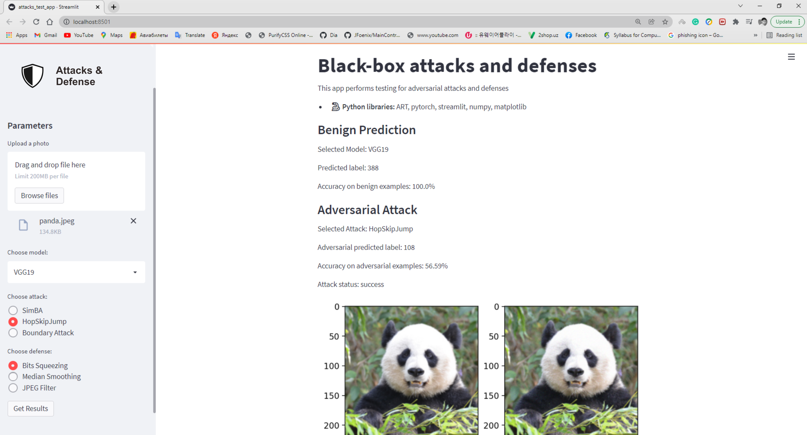

# Web Application 
Purpose: Creating web application for testing our experiments with any input image.  

#### Installing libraries 
```console
pip install adversarial-robustness-toolbox 
conda install -c conda-forge streamlit 

```

#### How to run web application 
```console
streamlit run web_app_bb_attacks.py 
```

##### Screenshot 1 
  
